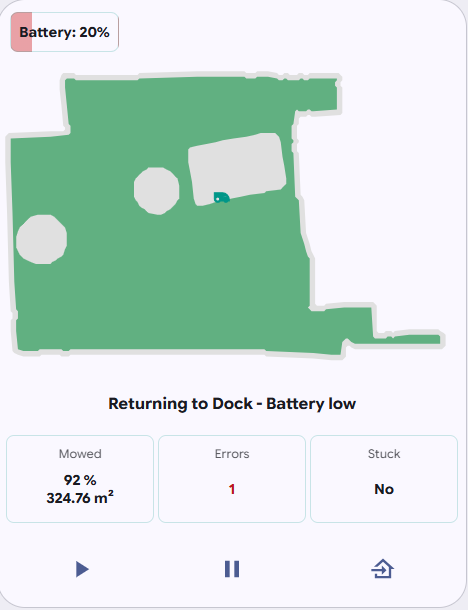
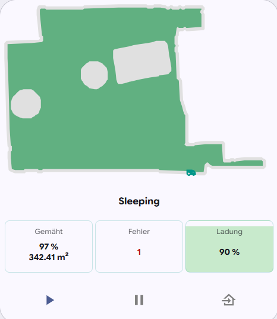
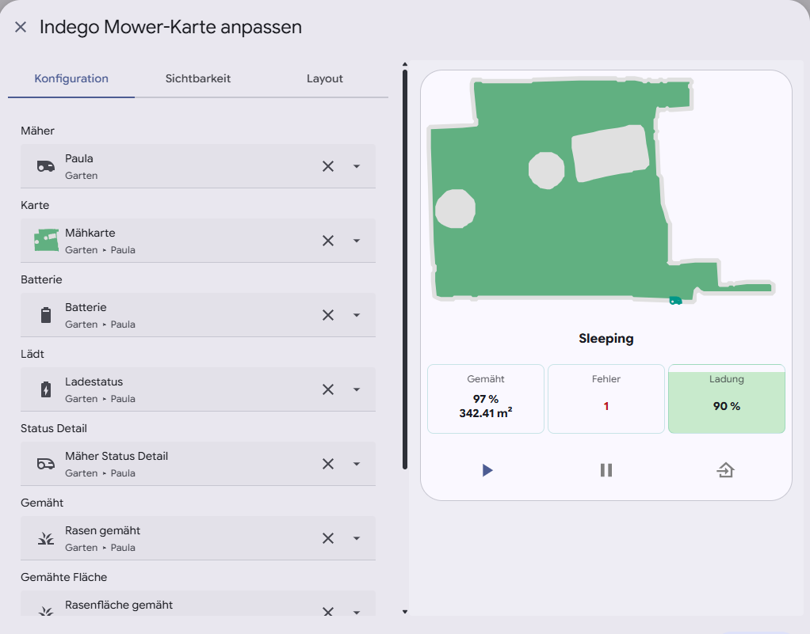

# Bosch Indego Mower Card

A modern Home Assistant Lovelace card for Bosch Indego robotic mowers.

The card provides a clean dashboard with live mower information, map display, battery visualization, mower controls and statistics in a single compact card.

> **Note**
>
> This card has been developed for the Bosch Indego integration but can also be used with compatible Home Assistant lawn mower entities.

---

## Features

- 🗺️ Live mower map
- 🔋 Dynamic battery visualization
- 📊 Mowing statistics
- ⚠️ Error counter
- 🚧 Stuck indication
- ▶️ Start mowing
- ⏸ Pause mowing
- 🏠 Return to dock
- 🌍 English & German translations
- ⚙️ Visual configuration editor
- 🎨 Full Home Assistant theme support

---

## Screenshots

### Mowing



### Docked



### Visual Editor



---

## Installation

### HACS (recommended)

1. Open **HACS**
2. Navigate to **Frontend**
3. Open the menu → **Custom repositories**
4. Add this repository `https://github.com/kimzeuner/Bosch-Indego-Mower-Card`
5. Category: **Dashboard**
6. Install **Bosch Indego Mower Card**
7. Restart Home Assistant

---

### Manual installation

Download the latest release and copy

```
indego-mower-card.js
```

to

```
/config/www/
```

Add the resource:

```yaml
resources:
  - url: /local/indego-mower-card.js
    type: module
```

Restart Home Assistant.

---

## Configuration

The card can be configured using the visual editor or YAML.

### Required

| Option | Description |
|----------|-------------|
| `entity` | Lawn mower entity |

---

### Optional

| Option | Description |
|----------|-------------|
| `map_entity` | Camera entity used to display the mower map |
| `battery_entity` | Battery percentage sensor |
| `charging_entity` | Charging binary sensor |
| `state_detail_entity` | Detailed mower status |
| `mowed_entity` | Mowed percentage |
| `mowed_size_entity` | Mowed area |
| `stuck_entity` | Binary sensor indicating whether the mower is stuck |
| `alert_entity` | Alert entity (supports sensors, counters and Bosch alert binary sensors) |

---

## Example

```yaml
type: custom:indego-mower-card
entity: lawn_mower.indego
map_entity: camera.indego
battery_entity: sensor.indego_battery
charging_entity: binary_sensor.indego_charging
state_detail_entity: sensor.indego_state_detail
mowed_entity: sensor.indego_mowed
mowed_size_entity: sensor.indego_mowed_area
stuck_entity: binary_sensor.indego_stuck
alert_entity: binary_sensor.indego_alert
```

---

## Supported alert entities

The card automatically supports multiple entity types.

### Counter

```
counter.indego_errors
```

Uses the entity state.

---

### Sensor

```
sensor.indego_errors
```

Uses the entity state.

---

### Bosch Binary Sensor

```
binary_sensor.indego_alert
```

Uses the attribute

```
alerts_count
```

automatically.

No template sensor is required.

---

## Compatibility

Tested with

- Home Assistant 2026.6.x
- Bosch Indego Integration

---

## Contributing

Contributions, bug reports and feature requests are welcome.

Please open an Issue or Pull Request on GitHub.

---

## Support this project ❤️

If this project saves you time or is useful to you, you can support its development:

[](https://www.paypal.me/KZeuner)

Thank you very much! 😊

---

## License

MIT License
